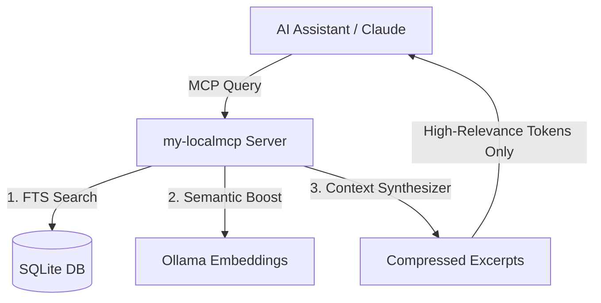

# 🚀 MY-LOCALMCP: Instant, Bounded Local Context & Memory

`my-localmcp` is a developer-first, high-fidelity **Model Context Protocol (MCP) server** designed to run entirely on your local machine. It connects your AI coding assistants (such as Claude Desktop, Claude Code, and Codex) to a fast, secure, and budget-aware repository intelligence system. 

By combining **SQLite-powered Full-Text Search (FTS)**, **Git-aware incremental indexing**, and optional **local Ollama semantic re-ranking**, `my-localmcp` serves as a local "second brain" for your AI assistant—without sending your code to external cloud indexers.

---

## 🔍 What It Does

`my-localmcp` bridges the gap between your local codebase and LLMs by providing high-precision, relevant code context when you ask questions.

1. **Deterministic Indexing**: Parses files, symbols (functions, classes), and Markdown headings into a local SQLite database.
2. **Instant Refresh**: Uses Git metadata to detect changed files instantly, refreshing only the modified parts in milliseconds.
3. **Budget-Aware Context Excerpts**: Instead of dumping entire 1,000+ line files into the LLM, it extracts precise, highly relevant windows around matched keywords and symbols.
4. **Implicit Retrieval Boost**: Learns from your coding session. If a file is shown and you ask to edit or view it, its priority increases for similar future tasks.
5. **Zero-Latency Fallbacks**: Gated Ollama integration ensures that even if local Ollama is offline or loading, the server degrades gracefully to instant FTS search without blocking.

---

## 💡 Key Use Cases

### 1. Navigating Legacy or Large Codebases
When working on a large repository, you don't know where specific logic resides. You can ask: *"Where does the database connection get initialized, and how are transaction rollbacks handled?"*
* **Without `my-localmcp`**: The AI reads the entire repo (exceeding token limits) or guesses.
* **With `my-localmcp`**: The server instantly performs full-text and semantic queries, locating the exact lines in `db.py` or `lifecycle.py` and presenting them as high-quality excerpts.

### 2. Fast Feature Onboarding & Tasks
When implementing a new feature matching a prior pattern (e.g., adding a new API endpoint): *"Find an example of a validated API endpoint and show its structure."*
* **With `my-localmcp`**: It scans the SQLite symbol table and returns the exact code block, enabling the AI to generate identical-style code immediately.

### 3. Fully Offline & Air-Gapped Coding
You are working on a train, flight, or in a secure enterprise environment without internet access.
* **With `my-localmcp`**: Since it uses SQLite and local Ollama (`qwen3.5:9b`, `mxbai-embed-large`), the entire retrieval and reasoning engine runs offline on your workstation.

---

## ⏱️ How It Saves Time & Money

| Metric | Traditional LLM Reading | with `my-localmcp` | The Benefit |
| :--- | :--- | :--- | :--- |
| **Token Consumption** | 20k - 100k+ tokens (whole files) | **1k - 3k tokens** (precise excerpts) | **8x - 10x cheaper** token cost & fits in small context windows. |
| **Prompt Latency** | 15s - 45s (due to giant prompt processing) | **1s - 3s** | Immediate responses, keeping you in the flow. |
| **Indexing Overhead** | Long background scans or cloud uploads | **Instant (<100ms)** | No waiting after checking out a branch or pulling code. |
| **Data Leakage Risk** | Code sent to third-party indexing vectors | **Zero** (100% Local) | Safe for proprietary, corporate, and private repositories. |

---

## 🛠️ The Architecture of Time-Savings

* **Git-Indexed Efficiency**: Rather than walking the directory tree and hashing every file every time, `my-localmcp` queries Git to find dirty files. If the commit hasn't changed, index checks take less than **5 milliseconds**.
* **One-Time Embedding Cache**: When semantic search is enabled, the server ensures the identical task query is embedded only once per call, preventing GPU load overhead and saving valuable seconds.
* **The "Never-Blocks" Guarantee**: Network timeouts and model-loading delays are isolated. If Ollama takes too long to respond, `my-localmcp` instantly falls back to SQLite FTS, returning high-quality search results in **0.1 seconds**.
