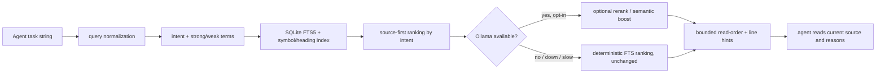

# my-localmcp

<div align="center">

**Deterministic, hash-aware repository context for Claude Code, Claude Desktop, and Codex — served entirely from your own machine.**

[](https://www.python.org/)
[](#platform-support)
[](LICENSE)
[](tests)
[](https://modelcontextprotocol.io)

[Quick start](#quick-start) · [How it works](#how-it-works) · [MCP tools](#mcp-tools-what-the-agent-calls) · [CLI reference](#cli-reference-my-localmcp) · [Setup reference](#setup-reference-installreinstalluninstall) · [Configuration](#configuration)

</div>

---

## What this is

`my-localmcp` is a local [MCP](https://modelcontextprotocol.io) server that sits between your coding agent (Claude Code, Claude Desktop, or Codex) and your repository. Instead of the agent burning tokens on broad `grep`/`read` sweeps to figure out where something lives, it asks `my-localmcp` one question — a task description, e.g. `"debug settings persistence: BackdropMaterial, LoadSettingsAsync"` — and gets back a small, ranked, hash-aware bundle of the exact files and line ranges worth reading, under a token budget.

It is **not** a code generator. It never writes source code itself, with one narrow exception: applying an exact, developer-approved unified diff (`apply_patch`), and even that goes through `git apply --check` first. Everything else — indexing, ranking, summarizing, retrieval — is deterministic, local, and reversible.

```
             ┌─────────────────────┐
  task   ──▶ │   my-localmcp        │ ──▶  ranked files + line ranges
 string      │  (SQLite FTS5 index) │      + agent read-order guidance
             └──────────┬───────────┘
                         │ optional, never required
                         ▼
                 local Ollama (rank / summarize / embed)
```

**Why it exists:** agents re-discover the same repository structure over and over, in every session, at real token cost. `my-localmcp` keeps a persistent, hash-aware index of your repo (files, symbols, headings) in SQLite so that "where is X" becomes a millisecond lookup instead of a fresh search every time — and it never depends on a model to work: Ollama is optional local enrichment layered on top, and every Ollama-touching path has a deterministic fallback.

### Core properties

| Property | What it means |
|---|---|
| **Deterministic core** | SQLite FTS5 + symbol/heading extraction. Same repo state → same ranked answer, every time. |
| **Local-only** | Nothing leaves your machine. No cloud indexer, no telemetry, no external API calls. |
| **Ollama is optional, never authoritative** | Ranking/summarization/embeddings only enrich; a down or slow Ollama degrades gracefully to pure FTS in well under a second — it never blocks or empties a response. |
| **Hash-aware** | Every indexed file is tracked by content hash. Changed files re-index automatically; unchanged files are never re-read. |
| **Shared, centralized memory** | One SQLite DB (`~/.my-localmcp/repo-context.sqlite`) holds every repo you've indexed, keyed by `repo_id` (root + git remote) — not one DB per project. |
| **Never generates code** | The only writer is `apply_patch`, and it only applies an exact diff you already approved, validated with `git apply --check` first. |
| **Retrieval-boost memory** | Implicitly learns which files actually get followed/edited for a recurring task string, and gives them a small, capped nudge — never overriding structural evidence. |

---

## Quick start

### 1. Requirements

- Python **3.12+**
- macOS or Windows (see [Platform support](#platform-support) — Linux is deferred)
- [Ollama](https://ollama.com) — **optional**, only needed if you want ranking/summarization/semantic re-rank enrichment

### 2. Install

Two ways in — pick one.

**Guided wizard** (recommended for first-time setup — a full-screen numbered console flow that explains every option):

```bash
git clone https://github.com/kartikeyajay2006/my-localmcp.git
cd my-localmcp
python3 setup_wizard.py
```

It detects your OS, walks you through Ollama model selection (fast/summary/embed), lets you pick which clients to connect (Claude Code, Claude Desktop, Codex), and builds the Claude Desktop `.mcpb` bundle for you. Every prompt shows its default and supports `b`/`back`. Add `--preview` to walk the whole flow risk-free against an in-memory simulation — no files, processes, or network touched.

**Scriptable CLI** (for automation / CI / power users):

```bash
python3 -m pip install "psutil>=5.9,<8"   # bootstrap dependency for setup.py itself
python3 setup.py install --client claude-code --client codex --add-to-path
```

Both paths call the same underlying lifecycle code (`my_localmcp/installer/`) — the wizard is a friendlier front end, not a second implementation. Full flag reference: [Setup reference](#setup-reference-installreinstalluninstall).

### 3. Verify

```bash
my-localmcp doctor
```

This runs a full read-only health check: config, repo index, Ollama reachability, and registered clients.

### 4. Index a repository and ask for context

```bash
cd /path/to/your/project
my-localmcp index

my-localmcp context "debug database transaction rollbacks: connect, commit_batch" \
  --token-budget 1000
```

Once a client (Claude Code, Claude Desktop, Codex) is registered, the agent calls these same operations itself via MCP tools — `prepare_context`, `file_excerpts`, `repo_lookup`, etc. — instead of you running the CLI by hand. See [MCP tools](#mcp-tools-what-the-agent-calls).

---

## How it works



1. **Query normalization** (`retrieval/query.py`) — parses a natural or hybrid task string (`"<natural task>: <known symbols/files>"`) into an intent (`debug` / `feature` / `refactor` / `test` / `explain` / `context`), strong terms (symbols, filenames, CamelCase/snake_case identifiers), weak terms (domain words), and filler to ignore.
2. **Deterministic ranking** (`retrieval/repo_memory.py` + `mcp/memory.py`) — scores candidates from the persistent SQLite FTS5 index against those terms, following an intent-specific policy (source → tests → config → status/notes → docs for debug/feature/refactor; status/notes → docs → source → tests for explain/overview). Docs/status files can promote real source files they mention by path.
3. **Optional enrichment, additive only** — if `ollama.embed_model` is set, already-FTS-selected candidates get a small `cosine * 18` semantic nudge; if `use_ollama=true` is passed, an LLM rerank runs on top. Both are strictly additive and gated — a repo with no embeddings, or a down Ollama, is byte-identical to the pure-deterministic path.
4. **Retrieval-boost memory** — once the *same* task string has been shown ≥3 times in a repo, files that were actually followed/edited get a small, capped (≤8) nudge on future occurrences of that task. It never penalizes silence and stays far below any structural (FTS) signal.
5. **Bounded output** — the agent gets back read-order + line-range hints inside a token budget, not whole files. Typical reduction: **8–10x fewer tokens** than reading the same files directly.
6. **The only writer** — `apply_patch` takes an exact unified diff (never generated here), runs `git apply --check` first, applies it, and re-indexes the changed paths.

Full design detail (context flow, ranking policy tables, DB schema, safety model) lives in [`docs/ARCHITECTURE.md`](docs/ARCHITECTURE.md).

---

## MCP tools (what the agent calls)

These are the tools exposed over stdio to any connected MCP client (Claude Code, Claude Desktop, Codex). An agent calls these directly — you don't need to run the CLI equivalents yourself once a client is registered.

| Tool | Purpose | Key parameters |
|---|---|---|
| `prepare_context` | Bounded, ranked, current-source excerpts for a task — the main entry point. | `task`, `repo_root="auto"`, `token_budget=3000`, `max_files=6`, `use_ollama=false`, `model` |
| `context_prepare` | Compatibility alias for `prepare_context` (kept for one release). | same as above |
| `file_excerpts` | Read several exact current-source ranges in one bounded call. | `ranges`, `repo_root`, `max_chars=20000`, `retrieval_id` (feeds retrieval-boost feedback) |
| `repo_lookup` | Precise search against the persistent index for a symbol or path. | `query`, `repo_root`, `limit=20` |
| `record_change` | Record a completed, verified change and re-index the affected paths. | `summary`, `paths`, `repo_root` |
| `repo_status` | Read-only report: index, config, git, and Ollama status. | `repo_root` |
| `doctor` | Full read-only health check across every subsystem. | `repo_root` |
| `refresh_index` | Refresh changed/stale/missing files in the persistent index. | `repo_root`, `max_files`, `force=false` |
| `summarize_file` | Summarize a file, or one Markdown heading section of it, and cache it by source hash. | `path`, `repo_root`, `model`, `heading` |
| `apply_patch` | Check or apply an exact, developer-approved unified diff. **The only tool that writes.** | `patch_text`, `repo_root`, `check_only=true` (defaults to validate-only) |
| `ollama_status` | Endpoint + installed/loaded model state, read-only. | `model`, `purpose="ranking"` |
| `ollama_ensure` | Ensure local Ollama and a model are ready; never starts a *remote* service. | `model`, `purpose="ranking"` |

`prepare_context` is the one to reach for first on almost any task — it replaces the agent's initial broad-search phase.

---

## CLI reference (`my-localmcp`)

Everyday, day-to-day operations once installed. All commands print JSON (except `context` with `--format text`, the default for humans).

### Status & diagnostics

```bash
my-localmcp status  [--repo-root auto]     # fast: config, DB, Ollama reachability
my-localmcp doctor  [--repo-root auto]     # full health check + command inventory
my-localmcp where   [--repo-root auto]     # install/config paths + repo being analyzed
my-localmcp model status                   # configured vs. reachable Ollama models
```

### Repository indexing

```bash
my-localmcp index      [--repo-root auto] [--max-files N] [--force]   # hash-aware index
my-localmcp refresh    [--repo-root auto] [--max-files N] [--force]   # update stale/missing only
my-localmcp reindex    [--repo-root auto] [--max-files N]             # force full rebuild
my-localmcp reset-repo [--repo-root auto] --yes                       # wipe THIS repo's index only
my-localmcp reset-all  --yes                                          # wipe the ENTIRE shared DB (every repo)
```

> `reset-repo`/`reset-all` refuse to run without `--yes` — there is no accidental wipe.

### Context & search

```bash
# Ranked, budgeted, current-source excerpts for a task
my-localmcp context "<task>" [--repo-root auto] [--max-files 6] [--token-budget 3000] \
                              [--ollama-rank] [--no-ollama] [--model NAME] \
                              [--format text|json|mcp_text|mcp_json]

# Search the persistent index for a file/symbol
my-localmcp lookup "<query>" [--repo-root auto] [--limit 20]

# One file's cached context, symbols, freshness, and an optional excerpt
my-localmcp file <path> [--repo-root auto] [--around-line N] [--context-lines 40]
```

`context` is deterministic (no Ollama) by default — pass `--ollama-rank` to opt in; `--no-ollama` always wins if both are given.

### Editing (writes only via exact diffs)

```bash
my-localmcp summarize <path> [--repo-root auto] [--model NAME] [--heading "Heading Name"]
my-localmcp apply-patch <patch-file-or-"-"> [--repo-root auto] [--check-only]
my-localmcp record-change "<summary>" <path> [<path> ...] [--repo-root auto]
```

`apply-patch` reads from a file, or from stdin with `-`. It always runs `git apply --check` before applying.

### Ollama management

```bash
my-localmcp set-ollama [--base-url URL] [--fast-model NAME] [--summary-model NAME] \
                        [--embed-model NAME] [--num-ctx N]

my-localmcp ollama status|ensure|start|warm|unload|stop|test [--model NAME] [--purpose ranking|query|summary]
```

`--embed-model ""` (empty string) explicitly disables the optional semantic-rerank layer; omitting the flag entirely just keeps the current value.

### Client & server management

```bash
my-localmcp config clients setup  [--client all|claude-code|claude-desktop|codex|codex-cli|codex-desktop]... [--dry-run]
my-localmcp config clients remove [--client ...]... [--dry-run]
my-localmcp config clients status                    # same as: my-localmcp clients

my-localmcp servers                                   # list running my-localmcp server processes
my-localmcp stop [--pid N | --all | --match-executable STR] [--timeout 12] [--no-force]
my-localmcp serve                                      # run the MCP server over stdio (used by clients, not by hand)
```

### Quality tooling

```bash
my-localmcp test-determinism "<task>" [--repo-root auto] [--runs 5] [--max-files 6] [--limit 6] \
                                        [--reset-repo] [--reindex-first]

my-localmcp benchmark <group>... [--repo-root auto] [--out DIR] [--queries FILE.jsonl]
```

`test-determinism` re-runs the same query N times and verifies a stable hash — the guarantee behind "same repo state → same answer." `benchmark` runs the repeatable retrieval-quality suite and never modifies existing repo memory.

---

## Setup reference (install/reinstall/uninstall)

`setup.py` is the sole lifecycle policy surface (macOS + Windows). It builds and validates a candidate runtime venv before promoting it, stops only processes it owns, unloads only its own Ollama models, preserves durable data by default, and restores your client registrations.

```bash
python3 setup.py install   [--clean] [--yes] [--dry-run] [--add-to-path] \
                            [--client claude-code|codex|claude-desktop]...

python3 setup.py reinstall [--dry-run] [--add-to-path] \
                            [--client claude-code|codex|claude-desktop]...

python3 setup.py uninstall [--delete-memory] [--yes] [--dry-run] \
                            [--client claude-code|codex|claude-desktop]...

python3 setup.py config-ollama [--base-url URL] [--fast-model NAME] \
                                [--summary-model NAME] [--embed-model NAME]

python3 setup.py manage-clients [--client claude-code|codex|claude-desktop]...
```

- **`install --clean`** deletes the entire managed root first (destructive — requires `--yes` when run non-interactively).
- **`uninstall`** by default removes only the runtime (`venv/`); your indexed repo memory and config survive. Pass `--delete-memory` for a full wipe (also requires `--yes` non-interactively).
- **`reinstall`** never deletes durable data — it's a transactional runtime swap.
- **`--dry-run`** on any of these prints the detected state and the exact ordered action plan without touching anything.
- The **guided wizard** (`python3 setup_wizard.py`) drives these exact same operations interactively — use whichever fits how you like to work.

---

## Configuration

Config lives at `~/.my-localmcp/config/config.yaml` (JSON content despite the extension — legacy naming, kept for compatibility). Key sections:

```jsonc
{
  "ollama": {
    "enabled": true,
    "base_url": "http://127.0.0.1:11434",
    "fast_model": "qwen3:8b",          // ranking
    "summary_model": "qwen3-coder:30b", // summarize_file
    "embed_model": null,                // optional semantic re-rank; null = disabled
    "auto_start_local": true
  },
  "repo": {
    "default_root": "auto",
    "exclude_dirs": ["node_modules", ".venv*", "dist", "build", "..."],
    "extra_exclude_dirs": [],           // your additions, unioned on top
    "include_extensions": ["...code-owned text extensions..."],
    "extra_include_extensions": []
  },
  "memory": {
    "db_path": "~/.my-localmcp/repo-context.sqlite",
    "retrieval_boost_cap": 8,
    "retrieval_boost_min_shown": 3
  }
}
```

- Change Ollama settings via `my-localmcp set-ollama` / `setup.py config-ollama` / the wizard — never hand-edit while a server is running.
- `exclude_dirs`/`include_extensions` are code-owned and rebuilt from defaults on every load (so security-relevant fixes reach every install automatically); add your own via the `extra_*` keys instead.
- Swapping `fast_model`/`summary_model` does **not** retroactively regenerate cached summaries — existing summaries stay tagged with the model that produced them until the source file changes or the cache is cleared explicitly. This is a deliberate design choice, not a bug (see `PROJECT_STATUS.md`).

---

## Platform support

| Platform | Status |
|---|---|
| macOS | ✅ Supported |
| Windows | ✅ Supported |
| Linux | ⏸ Deferred (not yet built) |

Repository memory is **centralized, not per-repo**: one shared SQLite DB holds every indexed repository, distinguished by `repo_id` (canonical root + git remote). `reset-all` affects every indexed repo, not just the one you're standing in — use `reset-repo` to scope the wipe to just the current one.

---

## Project layout

```
my_localmcp/
├── mcp/                 MCP server surface — server.py (FastMCP entrypoint),
│                         context_worker.py (isolated prepare_context subprocess),
│                         system.py / memory.py / ollama.py / editing.py (tool bodies)
├── retrieval/            deterministic engine — repo_memory.py (SQLite index +
│                         retrieval-boost memory), query.py (task-string parsing)
├── installer/             install/reinstall/uninstall lifecycle, the wizard, .mcpb builder
├── runtime_cli.py         `my-localmcp` console script (day-to-day CLI)
├── ollama_client.py        Ollama lifecycle, bounded inference/embedding, never auto-downloads
├── ai_client_config.py      registers/deregisters Claude Code, Claude Desktop, Codex
├── config.py                APP_DIR + config defaults (single source of truth)
├── repo_utils.py             path safety, subprocess wrappers, symbol extraction, git info
├── benchmarker/                retrieval-quality benchmarking suite
└── templates/                    /my-localmcp:* slash commands installed into Claude Code
```

Full module-by-module responsibilities: [`CLAUDE.md`](CLAUDE.md). Design rationale, DB schema, and the safety model: [`docs/ARCHITECTURE.md`](docs/ARCHITECTURE.md).

---

## Development

```bash
python -m pip install -e ".[test]"
python -m pytest -q                    # 432 tests across 34 files
python -m compileall -q my_localmcp setup.py

# Run the guided wizard against a risk-free in-memory simulation
python3 setup_wizard.py --preview
```

CI (`setup-v2.yml`) runs the fast suite in parallel (`pytest-xdist`) plus real, serial lifecycle tests that build real venvs on macOS and Windows. See [`.github/CONTRIBUTING.md`](.github/CONTRIBUTING.md) for the branch/PR/label workflow — `main` is merge-only and protected, every change goes through a PR with green CI.

---

## Documentation map

| Doc | Contents |
|---|---|
| [`docs/ARCHITECTURE.md`](docs/ARCHITECTURE.md) | Context flow, ranking policy, DB schema, safety model |
| [`PROJECT_STATUS.md`](PROJECT_STATUS.md) | Live status — current phase, verified behavior, known limitations |
| [`PROJECT_NOTES.md`](PROJECT_NOTES.md) | Append-only engineering decision/bug log |
| [`MCP_AGENT_INTEGRATION.md`](MCP_AGENT_INTEGRATION.md) | Canonical agent-loop guidelines and tool reference |
| [`CLAUDE.md`](CLAUDE.md) | Full module map and repo-wide conventions |
| [`IMP.md`](IMP.md) | Use cases and time/token-savings breakdown |

---

## License

MIT — see [LICENSE](LICENSE). Author: Kartikeya Yadav.
