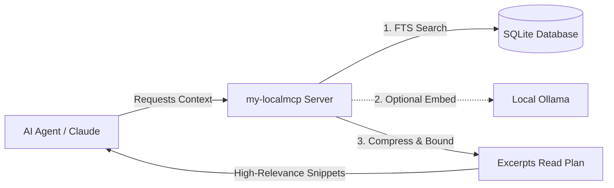

# 🚀 my-localmcp

<div align="center">

[](https://www.python.org/)
[](LICENSE)
[](https://github.com/kartikeyajay2006/my-localmcp)
[](https://github.com/kartikeyajay2006/my-localmcp)

</div>

---

## 🔮 A Futuristic, Deterministic Context Engine for AI Coding Agents

`my-localmcp` is a developer-first **Model Context Protocol (MCP) server** designed to run entirely on your local machine. It serves as an ultra-fast, local "second brain" for your AI assistants (Claude Desktop, Claude Code, and Codex), providing them with high-precision, budget-aware repository intelligence.

> [!IMPORTANT]  
> **100% Offline & Private:** Your code never leaves your machine. Indexing, text-search, and optional semantic re-ranking are performed locally using SQLite and Ollama.

---

## 🌐 3D Interactive Showcase

Experience the inner workings of `my-localmcp` through our futuristic **Interactive 3D Visualizer**. Open `showcase.html` in your web browser to explore:
* **The 3D Repository Core**: A WebGL-rendered, responsive visualization of your codebase structure.
* **Live Telemetry & Diagnostics HUD**: Real-time mock telemetry showing memory usage, database statistics, query latency, and token efficiency.
* **Interactive Terminal Simulation**: Test the setup wizard and CLI flows in a simulated, glassmorphic shell environment.

### How to run the Showcase:
Simply double-click the `showcase.html` file in the repository root or open it via terminal:
```bash
# macOS
open showcase.html

# Linux
xdg-open showcase.html

# Windows
start showcase.html
```

---

## ⚡ Key Capabilities

* **Deterministic FTS5 Indexing**: Sub-millisecond keyword lookup powered by SQLite. Synthesizes file symbols, classes, functions, and Markdown headings.
* **Smart Context Compression**: Extracts precise, high-relevance code excerpts around matching targets. Reduces context consumption by **8x-10x**, saving valuable token budget and prompt processing time.
* **Local Semantic Re-Ranking (Optional)**: Automatically integrates with **Ollama** (`mxbai-embed-large`, `bge-m3`) to re-rank candidates based on query semantics.
* **Implicit Retrieval Boost**: Learns from developer interactions. Automatically boosts the relevance of files and symbols frequently referenced or edited in your current session.
* **Zero-Latency Fallbacks**: Built on the "never-blocks" paradigm. If Ollama is loading or unreachable, retrieval gracefully degrades to SQLite FTS in **<0.1 seconds**.

---

## 🏗️ Architecture



For a comprehensive review of the design, check out the [Architecture Documentation](docs/ARCHITECTURE.md).

---

## 🚀 Quick Start

### 1. Installation
Ensure you have **Python 3.12 or newer**. Clone the repository and run the interactive setup wizard:

```bash
git clone https://github.com/kartikeyajay2006/my-localmcp.git
cd my-localmcp

# Launch the guided console wizard
python3 setup_wizard.py
```

> [!TIP]  
> The wizard dynamically detects your operating system, walks you through Ollama model selection, configures client integrations (Claude Code, Codex), and automatically builds the Claude Desktop bundle.

### 2. Manual CLI Installation
```bash
# Install the package and dependencies
python3 setup.py install --client codex
```

### 3. Usage Examples
Index your workspace and query context for a specific programming task:

```bash
# Index a repository
my-localmcp index --repo-root /path/to/project

# Run diagnostics to verify setup integrity
my-localmcp doctor --repo-root /path/to/project

# Request task-relevant context under a token budget
my-localmcp context "debug database transaction rollbacks in lifecycle.py" \
  --repo-root /path/to/project --token-budget 1000
```

---

## 📄 Documentation Map

* 📂 **[IMP.md](IMP.md)** — Detailed project overview, use cases, and time-saving metrics.
* 📂 **[Architecture Guide](docs/ARCHITECTURE.md)** — Context flow, ranking policies, database schemas, and safety boundaries.
* 📂 **[MCP Agent Integration](MCP_AGENT_INTEGRATION.md)** — Canonical loop guidelines and tool references for LLM integration.
* 📂 **[Project Status](PROJECT_STATUS.md)** — Release tracking, known limitations, and platform support matrix.
* 📂 **[Project Notes](PROJECT_NOTES.md)** — Historic engineering decisions and live verification logs.

---

## ⚖️ License & Attribution

* **Author:** Kartikeya Yadav
* **License:** Licensed under the MIT License - see the [LICENSE](LICENSE) file for details.
